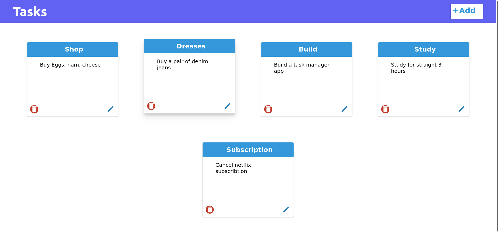
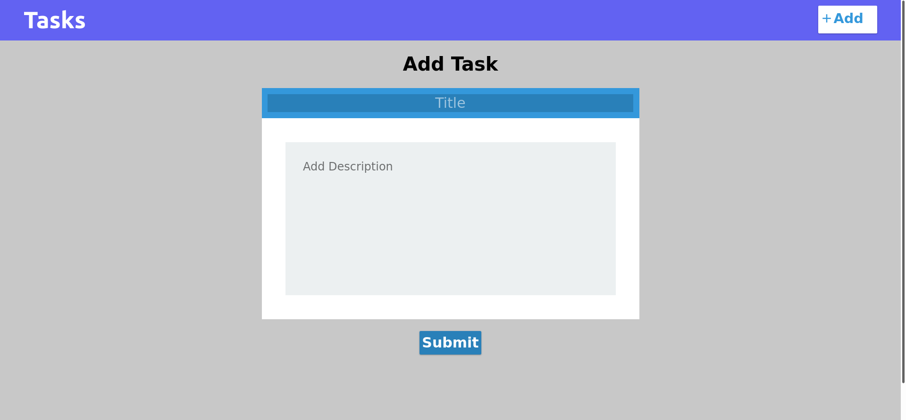

# Task-Man

This is a simple full-stack task manager application built with FastApi, Python, MongoDB, React and Typescript.

## Backend
---------------------
Check the requirements.txt files for all the modules used. Note that pipenv is used, so make sure to install and start the virtualenv.

Install and configure *MongoDB* server and all the other requirements related to it. Also go to [MongoDB Atlas](https://www.mongodb.com/cloud/atlas) to create a cluster if that's required.

*Install all modules:*
### `pipenv install -r requirements.txt` 

*Run the server:*
### `uvicorn main:app --reload`

## Frontend
-----------------------
Fontend Project build with TypeScript and React.

Project Inspirations: [Go to Github](https://github.com/jwmunn-og/notes-react-app)

In the project directory, run below commands.

*Install all modules:*
### `npm install or yarn`

*Run the server or start the application*
### `npm start or yarn start`

## Preview
----------------------

